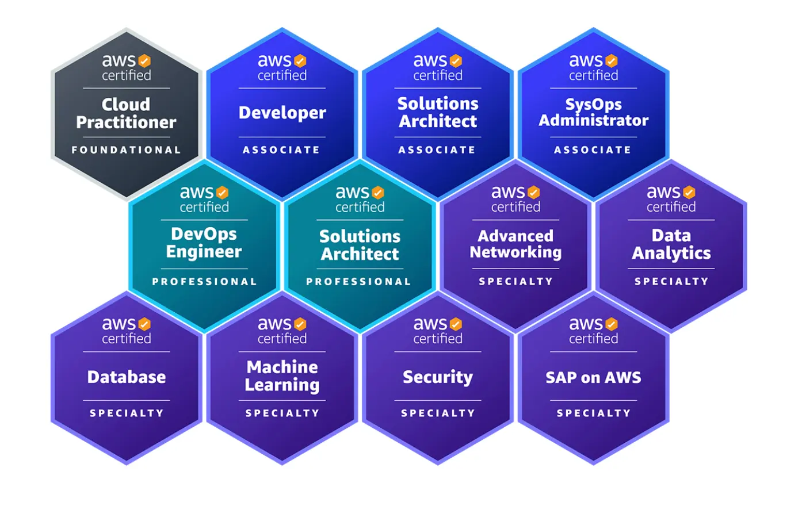

# Study Guide to Prepare the AWS Certifications

Below is a set of resources that will help us prepare for the different AWS certifications.

This guide covers the following certifications:

- Cloud Practitioner (Foundational)
- Developer (Associate)
- Solutions Architect (Associate)
- SysOps Administrator (Associate)

You will find **[guides and test exams here](content/readme.md).**

---

## Can I PR? There is an error/an alternative way/an extra question/solution I can offer

Absolutely! Feel free to PR and edit/add questions and solutions, but please stick to the existing format and do **not** commit real questions from the exam. This repo is not meant to be a certification dump.

## Can I fork it?

Yes, of course, but **only** if you plan to do a pull-request to contribute. If you want to keep it as a bookmark, just star it to let people easily find the original one.